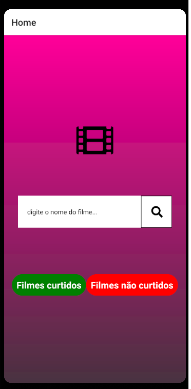
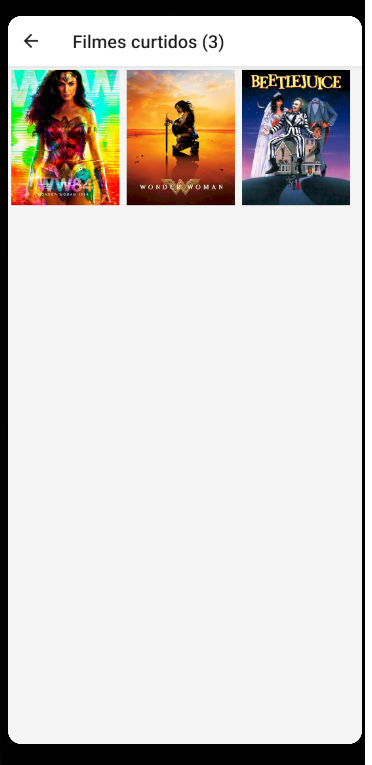
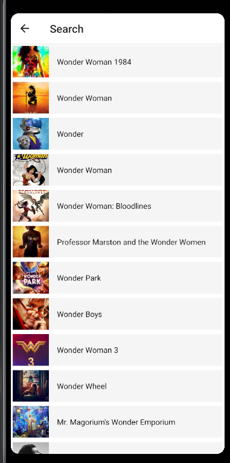

# react-native-review-movie-app

App de review de filme feito com react native, asyncStorage e api usada é themoviedb 

No app é possivel procurar o filme, e se encontrar é possivel da like ou dislike nele colocando assim na lista 
com respectivo nome, se der like ou dislike fica um icone transparente na imagem
 
Para usar é só baixar os arquivos e com terminal npm install e depois de instalar as dependencias "npx react-native run-android"

  
  
  
  

 
